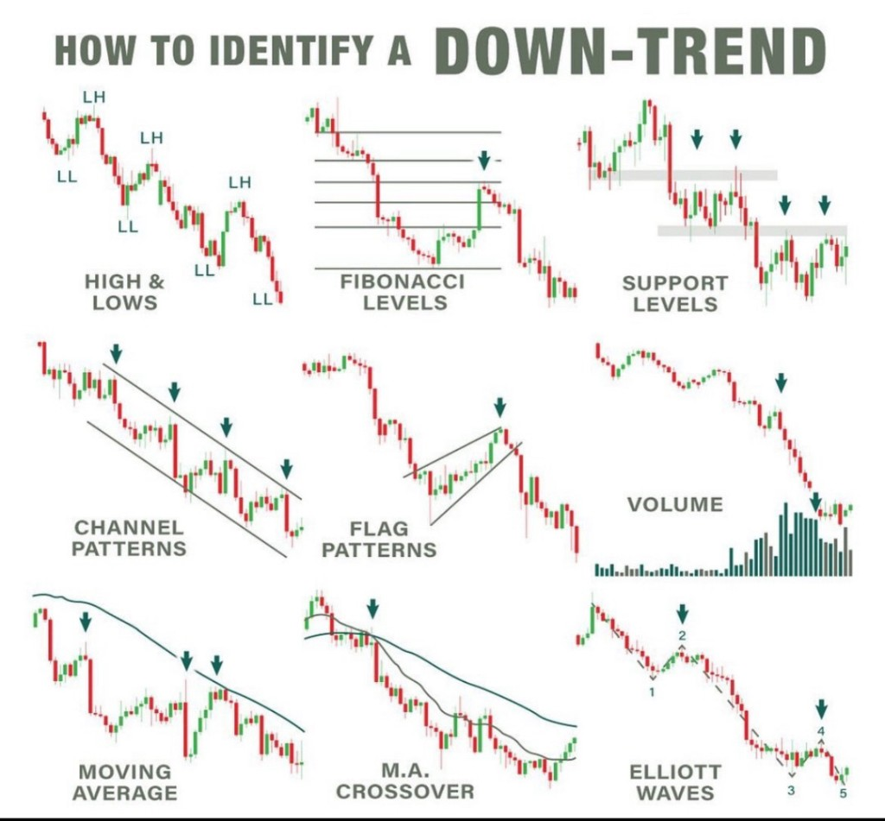
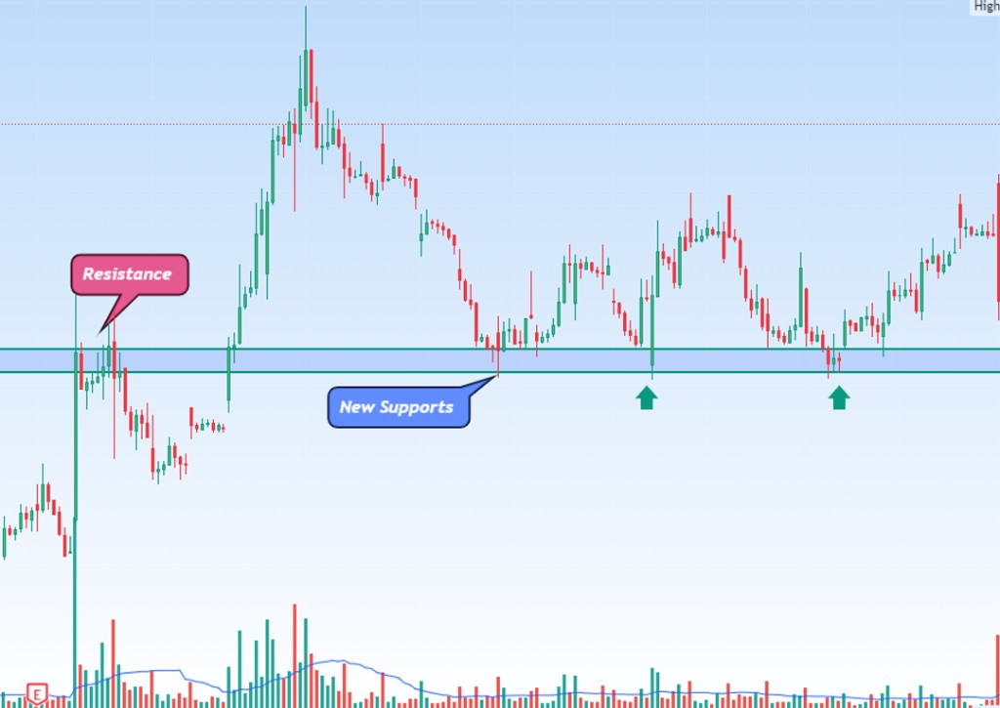
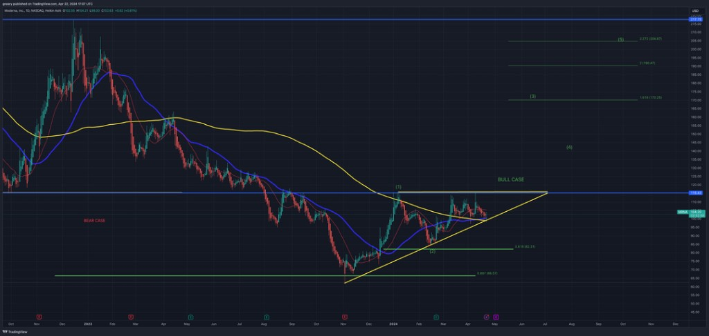
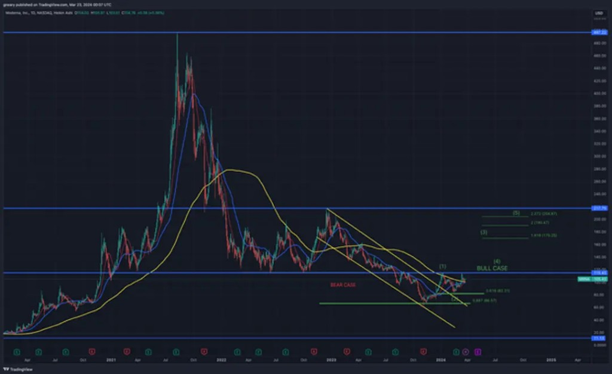
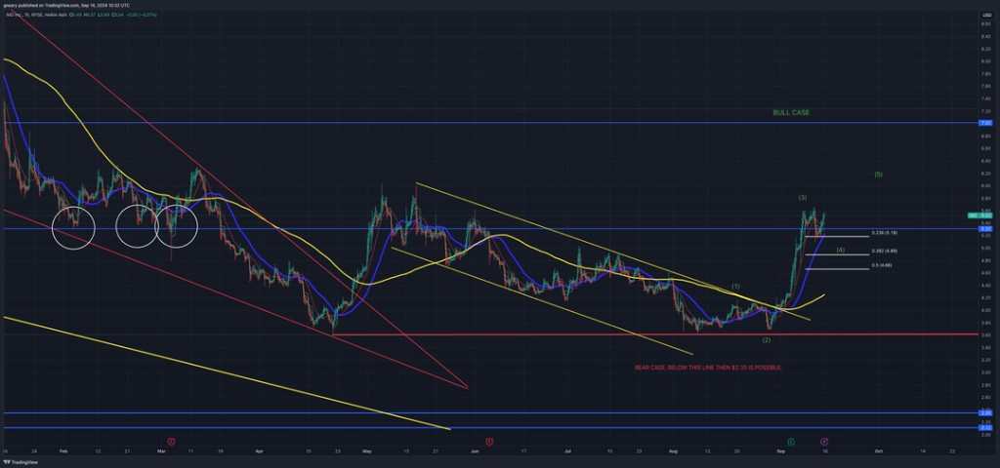
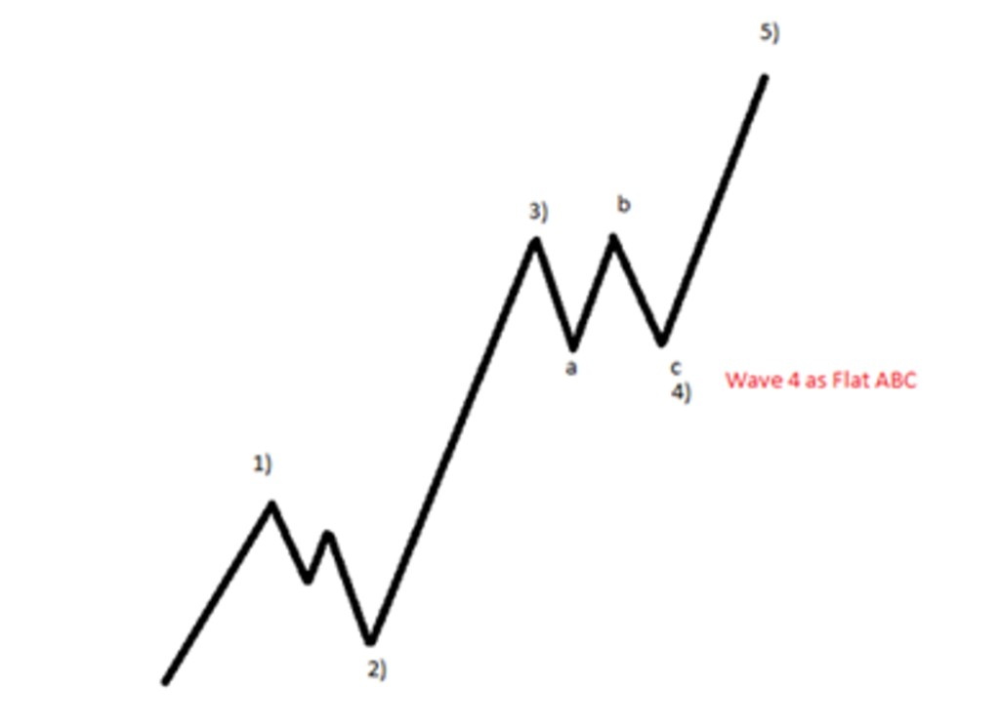
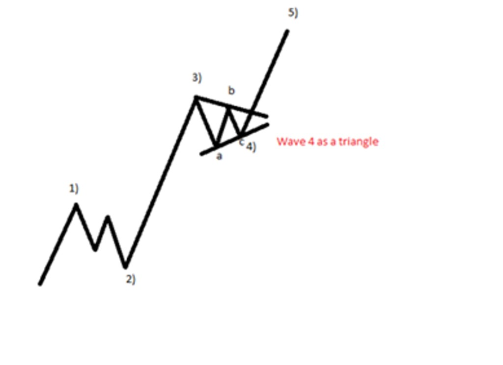
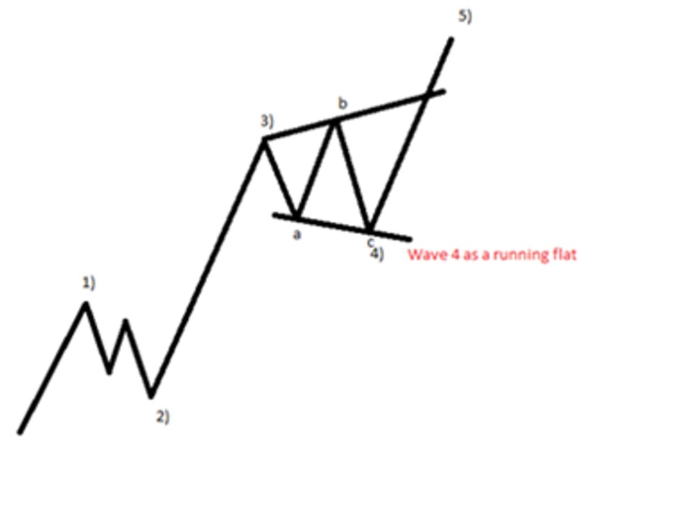
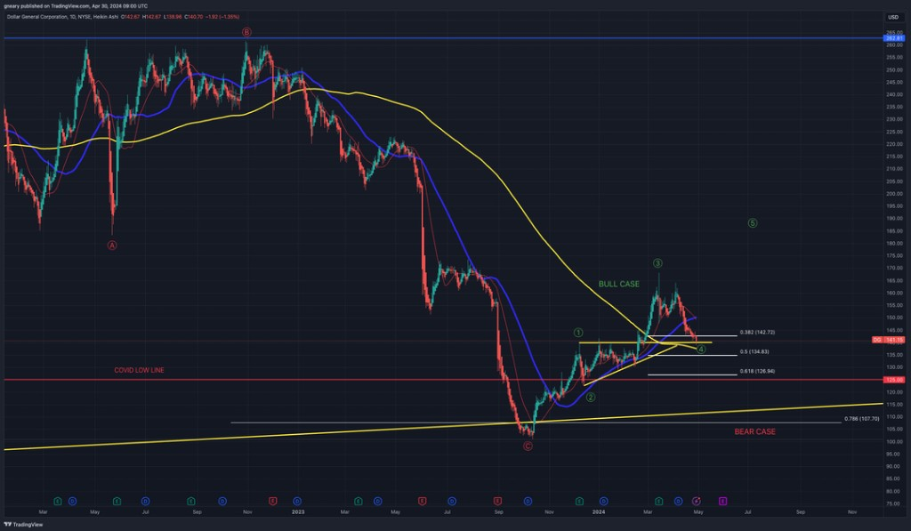
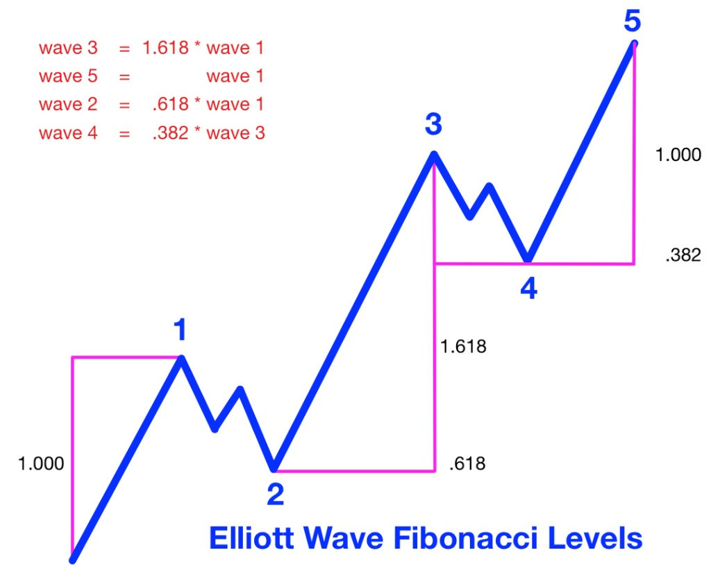

# EWT Algorithm — Full Reference

Elliott Wave framework from *Elliott Waves Made Simple* (Steve Sinclair) and *The Long Investor* course.
Referenced by `SKILL.md` — load when wave-counting detail or Fibonacci tables are needed.

---

## Trend Context — Identifying a Down-Trend

Use structure first, then confirm with confluence:

- Lower Highs and Lower Lows sequence
- Price below key moving averages and/or bearish MA crossover
- Broken support retested as resistance
- Bear-flag or channel continuation breakdowns
- Stronger volume on selloffs than on counter-trend rallies
- Wave context skewed bearish (downward motive legs with corrective rebounds)



This context decides whether to prefer bearish impulse/corrective counts before labeling sub-waves.

### Finding Support Confirmation

Support is a zone where buying interest is strong enough to slow/stop decline and potentially reverse price.

Common support identifiers (use confluence):
- Prior swing lows on the active timeframe
- Psychological round numbers
- Dynamic support from key moving averages (SMA 50 / SMA 200)
- Fibonacci retracement levels

EWT + Fib support expectations:
- Wave 2 pullback: often **0.50–0.618** of Wave 1
- Wave 4 pullback: often around **0.382** of Wave 3
- Wave C support hunt: often re-tests **0.50–0.618** zones

**Confluence rule:** the more independent signals align at one price area, the stronger the support level.

Two common support confirmation types:
1. **V-shape bounce** — single test and immediate recovery (often around earnings overreaction, stop sweeps, or institution bids)
2. **Multi-test base** — repeated tests over days/weeks, then higher highs + higher lows before impulse continuation

Extra confirmation signals:
- Rising volume on bounce from support
- Bullish candles near support (e.g. hammer, engulfing)
- Bullish RSI/MACD divergence near support

Risk caveat (cannot be forecast precisely):
- Earnings misses / lower guidance can break otherwise strong confluence support
- Macro or idiosyncratic shocks (black swans, investigations, takeover headlines, hostile reports) can invalidate setups quickly



### Moving Averages (SMA 50/200) — MRNA case

Use SMA 50 (blue) and SMA 200 (yellow) as a trend filter, mainly on **1H** and **Daily** charts.

Setup baseline on TradingView/Webull: add **SMA 50** and **SMA 200** indicators and keep a consistent color scheme (50 = blue, 200 = yellow) for faster pattern recognition.

- **Regime check (most important):** above SMA 200 favors bulls; below SMA 200 favors bears
- **Interaction signal:** SMA 50 crossing above SMA 200 = bullish trend shift (golden cross); crossing below = bearish shift
- **Structure confluence:** combine MA regime with pattern + wave context, not MA alone
- **MRNA example confluence:** ascending triangle (bullish), Wave 2 pullback holding near 0.618, and breakout retest near Wave 1 high

Reference charts:




---

## Position Sizing and Risk Allocation

Position sizing is core risk management: decide not only **what** to buy, but **how much**.

Why it matters:
- Protects capital so one bad position does not damage the portfolio
- Improves consistency by reducing fear/greed sizing decisions
- Allows larger allocation to high-conviction setups without uncontrolled risk

### Core framework

1. Define risk tolerance per trade (common baseline: **1–2%** of total portfolio)
2. Calculate max dollar risk:
   - `risk_dollars = portfolio_value * risk_pct`
3. Define invalidation (or stop) distance from entry:
   - `stop_pct = abs(entry - stop) / entry`
4. Calculate position size:
   - `position_value = risk_dollars / stop_pct`
   - `shares = risk_dollars / abs(entry - stop)`

Example A (percent-stop method):
- Portfolio = $100,000; risk = 1% → risk_dollars = $1,000
- Stop distance = 10%
- Position value = $1,000 / 0.10 = **$10,000**

Example B (price-distance method):
- Portfolio = $50,000; risk = 2% → risk_dollars = $1,000
- Entry = $50; stop = $45; risk/share = $5
- Shares = $1,000 / $5 = **200**
- Position value = 200 * $50 = **$10,000**

### Practical execution rules

- **Volatility adjust:** use smaller size for high-vol names, larger for stable names (within risk cap)
- **Conviction adjust:** increase size only slightly and only inside portfolio risk limits
- **Diversify:** do not concentrate all risk into one name/theme
- **Review periodically:** update sizing as volatility/regime and portfolio value change
- **Do not double down on losers:** prefer adding to winners as structure confirms

### Stop-loss note

Stop-loss usage is style-dependent. Some long-term investors avoid hard stops and use research conviction + time horizon instead; others use explicit stops to cap downside.  
If stops are used, avoid placing them mechanically at crowded levels without structure context.

### 5-part scaling method (group workflow)

Common execution pattern for a full allocation split into five tranches:

1. First buy: breakout + initial hold (Wave 1)
2. Second buy: retest/pullback (Wave 2)
3. Third buy: Wave 3 progression (often sub-wave 2 pullback)
4. Fourth buy: continued Wave 3 strength with confirmation
5. Fifth buy: reserve for unexpected pullback / breakout-level retest

This keeps initial risk controlled and increases exposure as the impulse confirms.

---

## Investing Cycle Framework

Use this as the default process from idea selection to recycle entries.

1. **Start with fundamentals**
   - Prefer fundamentally undervalued companies first.
   - Re-check fundamentals throughout the trade cycle; technical setup alone is not enough.

2. **Classify phase and trend**
   - Decide if the structure is currently motive (impulse) or corrective.
   - If motive and bullish, identify current wave position before sizing adds.

3. **Build early around Wave 2 completion (when available)**
   - Preferred early add zone is near Wave 2 support completion.
   - Set Wave 3 and Wave 5 targets immediately after count confidence improves.

4. **Manage around motive targets**
   - Trim part of exposure into Wave 3 completion (commonly near 1.618 extension).
   - Expect Wave 4 pullback, often near 0.382 of Wave 3.
   - Re-add when Wave 4 support confirms.
   - Consider taking up to ~50% profit into Wave 5 completion.

5. **Trade the corrective recycle (A-B-C)**
   - Re-enter after Wave A completion if fundamentals remain intact.
   - Trim into Wave B rejection.
   - Look to restart the cycle from Wave C completion, often near 0.50–0.618 retrace of the full prior impulse.

6. **Always run risk overlays**
   - Position size from invalidation/risk budget (see Position Sizing section).
   - Reassess if fundamentals deteriorate, guidance breaks, or macro shock changes assumptions.

This framework standardizes decisions: fundamentals gate entries, wave structure times actions, and risk sizing controls outcomes.

---

## The Motive Phase (moves with the trend)

### Impulse waves

Strong move in one direction: **five waves** (1–2–3–4–5). Uptrend = three up legs (1, 3, 5) and two corrections (2, 4); downtrend = mirror. Each wave subdivides into smaller patterns (**fractal** structure).

Four impulse patterns (shared framework; own rules): **Normal** (below), **Extended**, **Leading Diagonal**, **Ending Diagonal** — see sections below for the last three.

#### Normal Impulse (5-3-5-3-5)

| Wave | Role |
|------|------|
| 1 | Strong move with the trend |
| 2 | Corrects part of 1, not all |
| 3 | Strong with trend; usually longest/strongest |
| 4 | Corrects part of 3; shallower than 2 |
| 5 | Final push with trend; then larger correction (often ABC) |

Waves 1, 3, 5 → 5 sub-waves each. Waves 2, 4 → 3 sub-waves each.

**Hard rules (normal impulse only — never violated):**

| Rule | Uptrend | Downtrend |
|------|---------|-----------|
| 1 | Wave 2 never below **start** of Wave 1 | Wave 2 never above **start** of Wave 1 |
| 2 | Wave 3 never the **shortest** of 1, 3, 5 | Same |
| 3 | Wave 4 never in Wave 2 territory | Same |

**Rule 2:** Wave 3 is often longest; may be shorter than Wave 1 **or** Wave 5, but not shorter than **both**.

**If a rule breaks:**

| Rule | Meaning |
|------|---------|
| 1 | Not impulse start yet — count likely still **corrective** |
| 2 | Invalid impulse — re-label |
| 3 | Invalid impulse — often **ABC**; **exceptions:** Leading & Ending Diagonals |

**Practice:** Rules **1** and **3** are the main validators; when both hold, confirm impulse and project Wave 5 before the ABC that follows.

**Guidelines (common but not absolute):**
- Wave 2 typically retraces 50–61.8% of Wave 1
- Wave 4 typically retraces no more than 38.2% of Wave 3
- Wave 5 is typically the shortest of Waves 1, 3, 5

#### Wave 4 variations (impulse continuation context)

Goal is still the same: Wave 4 completes, then market breaks higher into Wave 5 to confirm impulse continuation.

Base case (most common):
- ABC pullback where `c` typically undercuts `a`
- Completion zone often near **0.382** retrace of Wave 3

Other observed variations to monitor while Wave 4 is forming:
1. **Flat correction:** sideways ABC; `c` retests `a` support area (often shallower, e.g. ~0.236)
2. **Triangle:** `c` forms a **higher low** inside a contracting structure
3. **Running-flat style variation (case-study label):** `b` spikes above Wave 3 high, then `c` sweeps lower before trend continuation

Execution note:
- Do not force a single label too early; if Wave 4 is still developing, track all valid alternatives until price confirms.
- Missing the first bounce is acceptable; after Wave 5, an ABC correction usually offers another entry window.

Reference charts:






### Extended Waves

A motive wave (1, 3, or 5) that is **significantly longer and stronger** than the other two motive waves in the same impulse. Typically **Wave 3**; can also be Wave 1 or Wave 5. On the chart it often appears as a **9-wave** subdivision of that leg (5-3-5-3-5-3-5-3-5) instead of five.

Driven by extreme sentiment — heavy buying in a bull market or selling in a bear market. Strongest volatility often follows **major fundamental news**; spikes after important events are a common place to see extended waves.

**Characteristics (common, not required on every count):**
- Longer duration and larger price range than the other motive waves
- Sub-waves within the extension may themselves be extended
- High volume and strong momentum
- Breakouts through key technical levels

**Use:** An extended Wave 3 (or 1/5) suggests the trend may continue strongly; helps project targets and spot tradeable momentum legs.

**Rules:** Same three hard rules as **Normal Impulse** (Rules 1–3 above). Wave 4 still must not enter Wave 2 territory on a normal extended impulse count.

### Leading Diagonal

Motive wave at the **beginning of a new trend** — five sub-waves (1–2–3–4–5) moving with the trend, but **not** counted like a normal impulse (overlap allowed).

**Where:** Only as **Wave 1** or **Wave A** (start of a structure).

**Key difference:** On a normal impulse, Wave 4 cannot enter Wave 2 territory. In an LD, sub-waves **may overlap** (Wave 4 may infringe Wave 2). This overlap exception applies **only** here at the structure start.

After an LD → expect a **deep pullback** (often a 3-wave correction); signals a new trend is forming.

**Rules (LD — uptrend / downtrend mirror):**

| Rule | Uptrend | Downtrend |
|------|---------|-----------|
| 1 | Wave 2 never below **start** of Wave 1 | Wave 2 never above **start** of Wave 1 |
| 2 | Wave 3 never the shortest of 1, 3, 5 (may be shorter than 1 **or** 5, not both) | Same |
| 3 | Wave 4 must hold **above the start** of Wave 2 | Wave 4 must hold **below the start** of Wave 2 |

**Case study — $DG (Leading Diagonal):**
- Question: Wave 4 overlapped prior sub-wave territory; is count invalid?
- Resolution: overlap is valid when structure is at the **start** of a new impulse (Wave 1 / Wave A), not the end.
- Context used: aggressive Wave C selloff (capitulation) into Oct 2023 suggested corrective exhaustion and impulse restart.
- Confirmation cues: sub-wave 4 pulled back in a 3-wave form, respected expected Wave-4 Fib retrace zone, and price held above the 200-day MA (bullish support).
- Decision rule: on overlap, first classify **where** the pattern sits (start = LD, end = ED) before invalidating the count.



### Ending Diagonal (ED)

Motive wave at the **end** of a move — **Wave 5** of an impulse or the **final leg of Wave C** in an A-B-C correction. Signals **exhaustion** of the larger trend; often followed by a **sharp reversal**.

**Structure:** Five sub-waves in a **3-3-3-3-3** pattern (each sub-wave subdivides into three smaller waves, not five).

**Look:** Sub-waves sit between **converging trendlines** — a **wedge** (wider at the start, narrowing toward the end). On a blank chart, a wedge at the late stage of a trend is the easiest ED clue (five waves, each with visible sub-structure).

**Key difference from normal impulse:** Wave 4 may **overlap Wave 1 territory** (forbidden on a standard impulse). Overlap is allowed only in this pattern at the structure end.

**Rules (ED — uptrend / downtrend mirror):**

| Rule | Uptrend | Downtrend |
|------|---------|-----------|
| 1 | Wave 2 never below **start** of Wave 1 | Wave 2 never above **start** of Wave 1 |
| 2 | Wave 3 never the shortest of 1, 3, 5 (may be shorter than 1 **or** 5, not both) | Same |
| 3 | Wave 4 must end **above the start** of Wave 2 | Wave 4 must end **below the start** of Wave 2 |

---

## The Corrective Phase (moves against the trend, labeled A-B-C)

### Simple Corrections

#### Zig-Zag (5-3-5)

Most common correction.
- Wave A: 5 sub-waves (motive)
- Wave B: 3 sub-waves; ends at 50–61.8% retracement of Wave A
- Wave C: 5 sub-waves; breaks beyond the end of Wave A

Rules (uptrend / correction downward):
- Wave B must end BELOW the start of Wave A
- Wave C must break BELOW the end of Wave A

Rules (downtrend / correction upward):
- Wave B must end ABOVE the start of Wave A
- Wave C must break ABOVE the end of Wave A

#### Flat Correction (3-3-5)

All three variants: Wave B ends near 78.6%–90% of Wave A (minimum).

| Type | Wave B | Wave C |
|------|--------|--------|
| Regular Flat | 78.6%–90% of A (doesn't exceed start of A) | Ends near end of A |
| Expanding Flat | Exceeds start of A (123.6%–161.8%) | Exceeds end of A |
| Running Flat | Exceeds start of A; C does NOT reach end of A | Weak — strong underlying trend |

#### Triangle Correction (3-3-3-3-3) — Labeled A-B-C-D-E

Found in Wave 4 (Motive) or Wave B (Corrective). Five sub-waves, each a 3-wave structure.

| Type | Rule |
|------|------|
| Contracting | Each leg smaller than previous (B < A, C < B, D < C, E < D) |
| Expanding | Each leg larger than previous (B > A, C > B, D > C, E > D) |
| Barrier | B and D end at similar horizontal level |
| Running | B briefly spikes beyond A (fundamental event spike) |

After a Triangle → expect a **thrust** in the direction of the prior trend.

### Complex Corrections

#### Double Three (3-3-3) — W-X-Y

Three connected simple corrections separated by X waves.
Each of W, X, Y = Zig-Zag, Flat, or Triangle.

Rules (downtrend):
- Wave X ends above the start of W
- Wave Y ends below the end of W

Rules (uptrend):
- Wave X ends below the start of W
- Wave Y ends above the end of W

**Simple trick:** A Double Three in a downtrend produces 7 swings. Count Higher Highs and Higher Lows from the correction start to identify W-X-Y.

#### Triple Three (3-3-3-3-3) — W-X-Y-X2-Z

Five connected three-wave corrections. Very rare. Label only when simpler alternatives don't fit.

---

## Fibonacci Levels

### Tools

1. **Fibonacci Retracement** — drawn from START of a wave to its END → finds where the NEXT correction ends
2. **Fibonacci Expansion (Projection)** — drawn from START → END of swing → PULLBACK point → finds where the NEXT impulse ends

### Key Levels

```
Retracement: 23.6%, 38.2%, 50.0%, 61.8%, 78.6%, 90%
Extension:   100%, 123.6%, 161.8%, 200%, 261.8%
```

### Motive Phase Targets

| Wave | Draw Fib From → To | Likely End Zone |
|------|-------------------|-----------------|
| Wave 2 end | W1 start → W1 end | 50%–61.8% retrace of W1 (min 38.2%) |
| Wave 3 end | W1 start → W1 end (expand from W2 low) | 161.8%–200% extension of W1 (min 100%); **261.8%** when extended |
| Wave 4 end | W3 start → W3 end | 23.6%–38.2% retrace of W3 |
| Wave 5 end | W4 end → inverse of W4 length (or compare with W1 length) | 100%–161.8% extension; often near 1.0x W1; **261.8%** when extended |
| Bigger-degree wave terminal | sub-(1) start → sub-(1) end | **261.8%** extension of the first sub-wave (sum-of-sub-waves projection) |

#### Impulse Fibonacci quick sequence (1-2-3-4-5)

- **Wave 1:** sets the initial reference swing
- **Wave 2:** usually corrects in 3 waves, commonly toward **0.618** of Wave 1
- **Wave 3:** project from Wave 1 length, anchored at Wave 2 low; **1.618** is the primary target, **2.618** is the standard target when Wave 3 is the *extended* leg (after major news/volatility breakouts)
- **Wave 4:** usually corrects in 3 waves, often near **0.382** retrace of Wave 3
- **Wave 5:** often near **1.0x Wave 1** in length; extends to **1.618** or **2.618** when Wave 5 is the *extended* leg

#### Bigger-degree wave terminal (do not skip 2.618)

When five sub-waves of the same degree complete, the bigger-degree wave they belong to typically prints close to **2.618** of the first sub-wave projected from its starting low/high. Always print this level alongside the sub-(3) `1.618` and sub-(5) `1.618` projections — it is the **runner trim / final exit zone** for the bigger-degree thesis.



### Corrective Phase Targets

| Wave | Draw Fib From → To | Likely End Zone |
|------|-------------------|-----------------|
| ZZ Wave B | A start → A end | 50%–61.8% retrace |
| ZZ Wave C | A start → A end (from B) | 100% extension (= end of A) |
| Regular Flat B | A start → A end | 78.6%–90% |
| Expanding Flat B | A start → A end | 123.6%–161.8% |
| Triangle waves | Each from prior swing | 61.8% of prior wave |
| Complex W | Prior impulse | 50%–61.8% of prior impulse |
| Complex X | W start → W end | 50%–78.6% of W |
| Complex Y | W start → W end (from X) | 100%–123.6% of W |

---

## EWT Algorithm Pseudocode (Future Rust Implementation)

```pseudocode
FUNCTION analyse_ticker(ticker: String) -> EWTAnalysis:

  // 1. Fetch OHLCV data (Weekly, Daily, 4H)
  data_w  = fetch_ohlcv(ticker, "1W", bars=200)
  data_d  = fetch_ohlcv(ticker, "1D", bars=200)
  data_4h = fetch_ohlcv(ticker, "4H", bars=200)

  // 2. Find significant turning points (swing highs/lows)
  swings = find_swings(data_w, lookback=10)

  // 3. Determine trend direction
  trend = classify_trend(swings)  // BULLISH | BEARISH | SIDEWAYS

  // 4. Attempt Motive wave count from last major swing low/high
  motive_count = attempt_impulse_count(data_d, swings, trend)

  // 5. Validate against hard rules
  IF NOT validate_impulse_rules(motive_count):
    motive_count = attempt_diagonal_count(data_d, swings, trend)

  // 6. If motive count fails, attempt corrective count
  IF NOT motive_count.valid:
    corrective_count = attempt_corrective_count(data_d, swings, trend)
    current_count = corrective_count
  ELSE:
    current_count = motive_count

  // 7. Calculate Fibonacci levels
  fibs = calculate_fibonacci_levels(current_count)

  // 8. Check RSI divergence
  rsi        = calculate_rsi(data_4h, period=14)
  divergence = detect_divergence(data_4h.close, rsi, current_count.wave_number)

  // 9. Check chart patterns
  pattern = detect_chart_pattern(data_d, current_count)

  // 10. Generate output
  RETURN EWTAnalysis {
    ticker,
    wave_position:    current_count,
    fibonacci_levels: fibs,
    rsi_divergence:   divergence,
    chart_pattern:    pattern,
    add_zones:        fibs.retracements,
    trim_zones:       fibs.extensions,
    stop_loss:        current_count.invalidation_level,
    confidence:       calculate_confidence(current_count, divergence, pattern)
  }

FUNCTION validate_impulse_rules(count: WaveCount) -> bool:
  wave2_low > wave1_start          // Rule 1: W2 never below W1 start
  wave3 != shortest_of(w1, w3, w5) // Rule 2: W3 never shortest
  wave4_high < wave2_high          // Rule 3: W4 never in W2 territory

FUNCTION calculate_fibonacci_levels(count: WaveCount) -> FibLevels:
  // Retracements (corrective wave end)
  retrace_382 = wave_start + (wave_range * 0.382)
  retrace_50  = wave_start + (wave_range * 0.500)
  retrace_618 = wave_start + (wave_range * 0.618)
  retrace_786 = wave_start + (wave_range * 0.786)

  // Extensions (impulsive wave target)
  extend_100  = wave_end + (wave_range * 1.000)
  extend_1236 = wave_end + (wave_range * 1.236)
  extend_1618 = wave_end + (wave_range * 1.618)
  extend_200  = wave_end + (wave_range * 2.000)
  extend_2618 = wave_end + (wave_range * 2.618)   // extended W3/W5 + bigger-degree terminal

  RETURN FibLevels { retracements, extensions }
```
